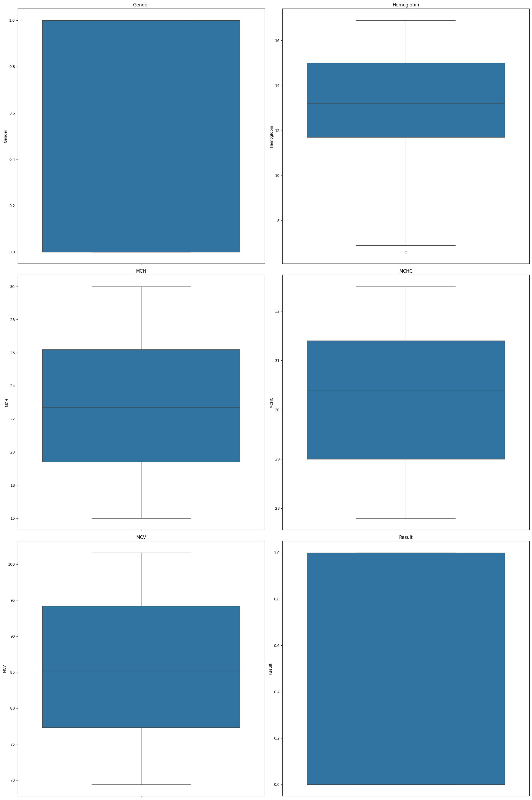
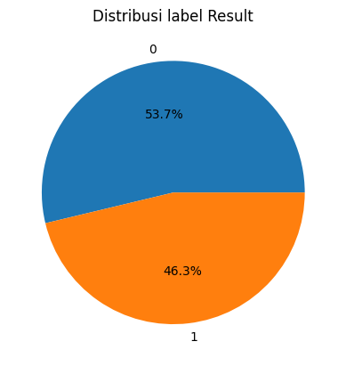
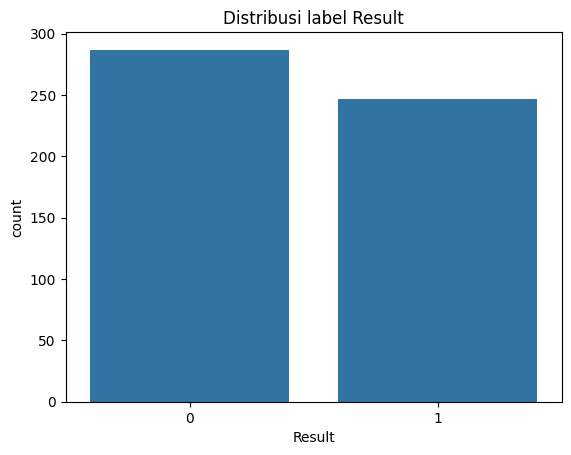
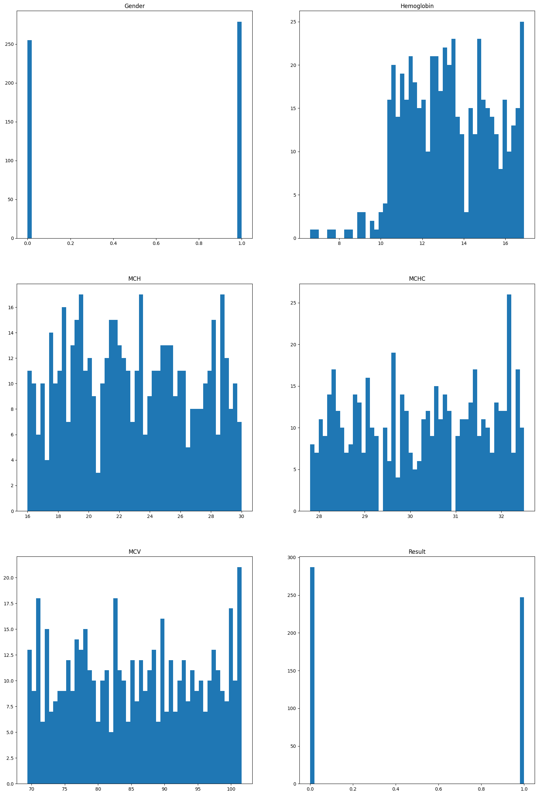
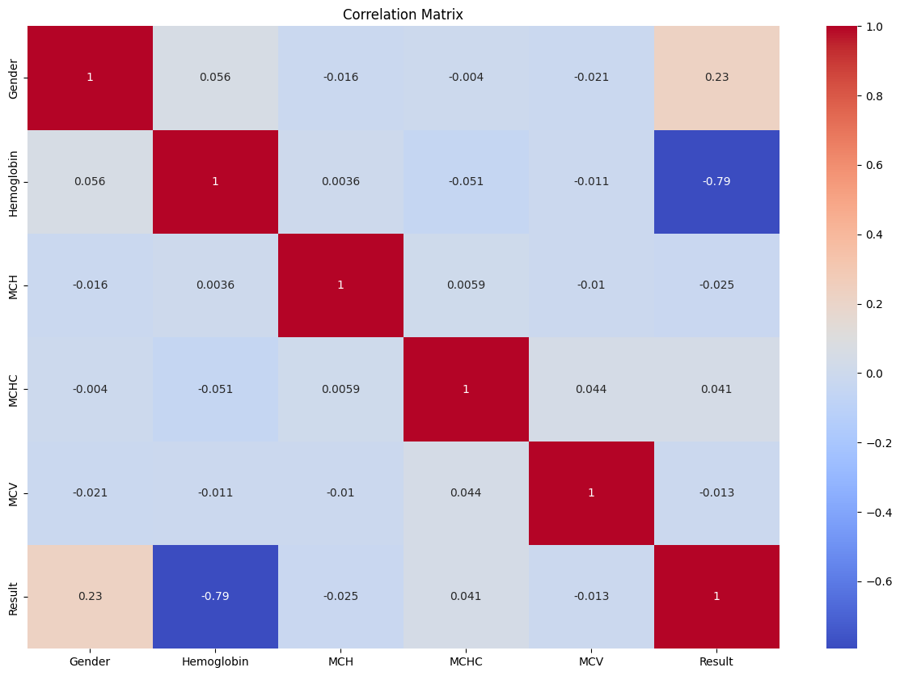
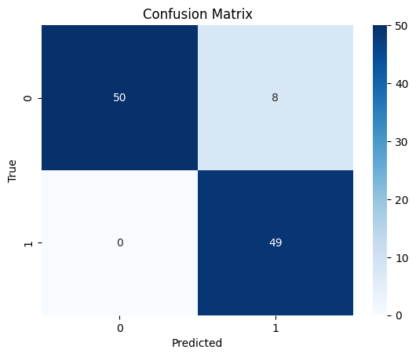
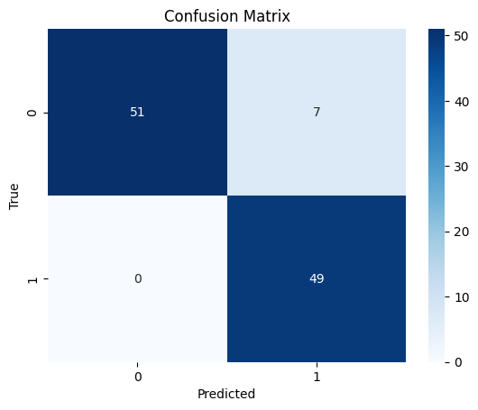
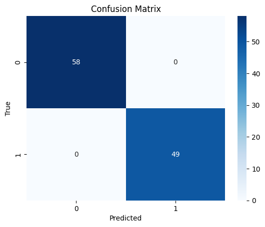

# **Laporan Proyek Machine Learning: Klasifikasi Anemia - Cindy Alya Putri**


## **Domain Proyek**

### **Latar Belakang**

Anemia merupakan kondisi kekurangan hemoglobin dalam darah yang menyebabkan tubuh kekurangan oksigen. Masalah ini umum terjadi dan berdampak serius terhadap kesehatan, terutama pada wanita hamil dan anak-anak. WHO melaporkan bahwa lebih dari 40% wanita hamil dan anak balita di dunia mengalami anemia [1].
Proses diagnosis anemia biasanya dilakukan dengan analisis laboratorium terhadap parameter darah seperti Hemoglobin, MCH, MCHC, dan MCV. Namun, analisis manual memiliki keterbatasan, seperti waktu yang lama dan potensi ketidakkonsistenan antar tenaga medis.
Oleh karena itu, dibutuhkan pendekatan yang lebih cepat dan akurat. Machine learning menjadi solusi yang potensial karena mampu mengolah data medis dan memberikan prediksi diagnosis secara otomatis. Ramzan et al. (2024) mengembangkan model berbasis attention mechanism yang meningkatkan akurasi deteksi anemia [2]. Penelitian lain oleh Dhakal et al. (2023) dan Asare et al. (2023) juga menunjukkan bahwa algoritma seperti Random Forest dan SVM efektif dalam klasifikasi anemia [3][4].

Dengan pendekatan ini, sistem klasifikasi anemia berbasis machine learning diharapkan dapat membantu proses diagnosis menjadi lebih efisien, akurat, dan mendukung pengambilan keputusan medis secara objektif.

---

### **Referensi**

\[1] World Health Organization, “Anaemia,” WHO, 2021. [Online]. Available: https://www.who.int/news-room/fact-sheets/detail/anaemia

\[2] M. Ramzan et al., “Revolutionizing anemia detection: integrative machine learning models and advanced attention mechanisms,” Vis. Comput. Ind. Biomed. Art., vol. 7, no. 1, p. 18, 2024, doi: 10.1186/s42492-024-00169-4.

\[3] P. Dhakal, S. Khanal, and R. Bista, “Prediction of anemia using machine learning algorithms,” Int. J. Comput. Sci. Inf. Technol., vol. 15, pp. 15–30, 2023, doi: 10.5121/ijcsit.2023.15102.

\[4] J. W. Asare, P. Appiahene, and E. T. Donkoh, “Detection of anaemia using medical images: A comparative study of machine learning algorithms – A systematic literature review,” Inform. Med. Unlocked, vol. 40, p. 101283, 2023, doi: 10.1016/j.imu.2023.101283.

---

## **Business Understanding**

### **Problem Statements**
* Bagaimana mengklasifikasikan kondisi seseorang sebagai anemia atau tidak berdasarkan data parameter darah seperti Hemoglobin, MCH, MCHC, MCV, dan jenis kelamin?

* Apakah model machine learning dapat membantu proses diagnosis anemia dengan akurasi dan konsistensi yang tinggi?

### **Goals**

* Membangun model machine learning yang mampu mengklasifikasikan kondisi anemia berdasarkan data fitur darah dan jenis kelamin.
  
* Mengukur dan membandingkan performa beberapa algoritma untuk memilih model dengan hasil terbaik dalam mendeteksi anemia.

### **Solution Statements**

Untuk mencapai tujuan, solusi yang diterapkan meliputi:

1. **Penerapan Multi-Model**:
   Membangun dan membandingkan performa dari **4 algoritma**:
   
   * Support Vector Machine (SVM)
   * K-Nearest Neighbors (KNN)
   * Random Forest
   * XGBoost (Gradient Boosting)

2. **Evaluasi Terukur**:
   Setiap model dievaluasi berdasarkan metrik:

   * **Accuracy**
   * **Precision**
   * **Recall**
   * **F1-Score**

3. **Preprocessing**:
   Mengatasi data duplicate, serta melakukan **scaling**.

---

## **Data Understanding**

### **Sumber Data**

Dataset: [Anemia Dataset– Kaggle]((https://www.kaggle.com/datasets/biswaranjanrao/anemia-dataset))
Jumlah data: 
- 6 kolom
- 1422 baris

Jumlah fitur: **5 fitur numerik + 1 target**

### **Deskripsi Target**

* **Result**:

  * `0.0` = Normal
  * `1.0` = Anemia

### **Daftar Kolom**

Berikut adalah penjelasan singkat per kolom dalam satu kalimat per poin: 

1. **`Gender`**: 0 untuk laki-laki dan 1 untuk perempuan
2. **`Hemoglobin`**: Jumlah kenaikan mendadak detak jantung janin per detik.
3. **`MCH`**: Jumlah gerakan janin yang terdeteksi per detik.
4. **`MCHC`**: Intensitas kontraksi rahim yang terukur per detik.
5. **`MCV`**: Penurunan ringan detak jantung janin dalam periode tertentu.

### **Kondisi Dataset**
Terdapat 887 data duplikat ditemukan dalam dataset dari total 1421 data, yang berarti sekitar 62% merupakan duplikasi. 
Penghapusan data duplikat ini perlu dilakukan untuk menghindari bias model terhadap pola data yang berulang-ulang dan meningkatkan efisiensi komputasi. 
Setelah dihapus, jumlah data menjadi sekitar 534 baris yang masih cukup untuk eksplorasi awal dan pelatihan model dasar.

### **Struktur Data**

```python
<class 'pandas.core.frame.DataFrame'>
RangeIndex: 1421 entries, 0 to 1420
Data columns (total 6 columns):
 #   Column      Non-Null Count  Dtype  
---  ------      --------------  -----  
 0   Gender      1421 non-null   int64  
 1   Hemoglobin  1421 non-null   float64
 2   MCH         1421 non-null   float64
 3   MCHC        1421 non-null   float64
 4   MCV         1421 non-null   float64
 5   Result      1421 non-null   int64  
dtypes: float64(4), int64(2)
memory usage: 66.7 KB
```

### **EDA (Exploratory Data Analysis)**

* Visualisasi distribusi tiap fitur untuk deteksi outlier menggunakan Boxplot.
#### Hasil Visualisasi


Dari hasil visualisasi box plot di atas, sebagian besar kolom seperti MCH, MCHC, dan MCV tidak menunjukkan adanya outlier yang mencolok. Namun, pada kolom Hemoglobin terlihat terdapat satu nilai yang berada jauh di bawah rentang utama data.

Meskipun secara statistik nilai tersebut termasuk outlier, saya memutuskan tidak menghapusnya. Hal ini karena nilai ekstrem tersebut justru dapat merepresentasikan kondisi anemia berat, yang penting untuk dipertahankan dalam konteks analisis. Menghapus outlier seperti ini dapat mengurangi variasi dan representasi kasus nyata dalam data, sehingga akan mempengaruhi akurasi dan generalisasi model yang dikembangkan.

* Distribusi kelas target menggunakan Pie chart dan Bar chart
#### Hasil Visualisasi 



Dari hasil visualisasi di atas dapat terlihat distribusi label pada dataset menunjukkan proporsi yang cukup seimbang antara kelas negatif dan positif anemia. Oleh karena itu, teknik augmentasi data tidak menjadi kebutuhan utama dalam tahap awal pemodelan. Penggunaan augmentasi justru dapat menimbulkan risiko jika tidak dikontrol dengan baik

* Distribusi data setiap kolom menggunakan histogram



Berdasarkan sebaran data pada histogram, fitur numerik seperti Hemoglobin, MCH, MCHC, dan MCV menunjukkan distribusi yang tidak normal dan rentang nilai yang bervariasi. Oleh karena itu, normalisasi data sangat disarankan agar model machine learning dapat mempelajari pola dengan lebih adil dan optimal, terutama jika menggunakan algoritma yang sensitif terhadap skala data.


* Korelasi antar fitur untuk menghindari multikolinearitas menggunakan Heatmap
#### Hasil Visualisasi


Dari heatmap, didapatkan beberapa insight : 

Berdasarkan hasil visualisasi korelasi (heatmap), dapat dilihat bahwa sebagian besar fitur dalam dataset anemia memiliki tingkat korelasi yang rendah terhadap label target Result. Korelasi tertinggi ditemukan antara fitur `Gender dengan Result sebesar 0.23, sedangkan korelasi terendah adalah antara Hemoglobin dengan Result sebesar -0.79. Nilai korelasi negatif yang cukup kuat ini menunjukkan bahwa semakin rendah nilai hemoglobin, semakin besar kemungkinan seseorang mengalami anemia, yang secara medis memang relevan.

Fitur-fitur lain seperti MCH, MCHC, dan MCV menunjukkan korelasi sangat lemah terhadap Result, dengan nilai korelasi yang mendekati nol. Hal ini menandakan bahwa tidak ada hubungan linier yang signifikan antara fitur-fitur tersebut dengan label target. Namun, meskipun korelasinya rendah secara linier, fitur-fitur ini tetap dapat memberikan kontribusi terhadap performa model, terutama jika menggunakan algoritma pembelajaran mesin yang mampu menangkap pola non-linier seperti Random Forest atau Neural Network.

Secara umum, hasil korelasi ini menunjukkan bahwa fitur Hemoglobin memiliki potensi paling kuat sebagai prediktor utama untuk anemia dalam dataset ini, sedangkan fitur lainnya berperan sebagai pendukung dalam proses klasifikasi. Tidak ada fitur yang perlu dihapus berdasarkan nilai korelasi saja, karena kontribusi fitur bisa lebih kompleks dari sekadar hubungan linier.

### Hasil akhir :  

Dari proses EDA yang telah dilakukan, didapatkan beberapa insight terkait dengan dataset, yaitu:

* Ditemukan sebanyak 887 data duplikat dari total 1421 baris data, atau sekitar 62% merupakan data yang identik. Penghapusan data duplikat harus dilakukan untuk menghindari bias pada model serta meningkatkan efisiensi komputasi. Setelah penghapusan, data yang tersisa sebanyak 534 baris unik dan tetap dapat digunakan untuk proses eksplorasi dan pemodelan awal.

* Tidak ditemukan missing value pada dataset ini, sehingga tidak dilakukan tindakan lebih lanjut terkait penanganan data kosong.

* Hasil visualisasi boxplot menunjukkan bahwa sebagian besar kolom seperti MCH, MCHC, dan MCV tidak memiliki outlier ekstrem. Namun, pada kolom Hemoglobin, terdapat satu nilai rendah yang secara statistik termasuk outlier. Nilai ini tidak dihapus karena masih mungkin merepresentasikan kondisi anemia berat yang valid secara medis, dan tetap dipertahankan agar variasi data tetap mencerminkan kondisi nyata.

* Berdasarkan visualisasi pie chart dan bar chart, distribusi label pada kolom Result tampak seimbang antara penderita anemia dan non-anemia. Tidak ditemukan dominasi kelas tertentu dalam jumlah yang signifikan, sehingga kondisi ini tidak menimbulkan permasalahan imbalance pada tahap pemodelan.

* Berdasarkan visualisasi histogram, distribusi nilai pada beberapa fitur numerik seperti Hemoglobin, MCH, MCHC, dan MCV tidak mengikuti pola distribusi normal. Beberapa fitur menunjukkan pola right skewed dan ada juga yang left skewed. Dengan kondisi distribusi seperti ini, proses normalisasi diterapkan untuk menyamakan skala dan pola sebaran nilai antar fitur sebelum masuk ke tahap pelatihan model.

* Dari hasil visualisasi heatmap, korelasi antar fitur dan label target Result menunjukkan nilai yang bervariasi. Korelasi tertinggi yaitu antara Gender dan Result sebesar 0.23, sedangkan korelasi terendah adalah antara Hemoglobin dan Result sebesar -0.79. Korelasi negatif yang kuat pada hemoglobin menunjukkan hubungan yang relevan secara medis, yaitu semakin rendah kadar hemoglobin, semakin besar kemungkinan seseorang mengalami anemia. Sementara fitur lain seperti MCH, MCHC, dan MCV memiliki korelasi yang mendekati nol terhadap label Result, namun tetap dapat menjadi bagian dari input model karena beberapa algoritma mampu menangkap pola non-linier dari data.


---

## **Data Preparation**
Setelah data duplikat dihapus data yang tersisa sebanyak 534 baris unik dan tetap dapat digunakan untuk proses eksplorasi dan pemodelan awal, dataset menjadi lebih bersih dan siap digunakan untuk tahap berikutnya. Langkah selanjutnya adalah memisahkan variabel independen (fitur) dan variabel dependen (target) ke dalam dua variabel terpisah, yaitu X untuk fitur dan y untuk label. Pemisahan ini penting sebagai persiapan sebelum proses pelatihan model dilakukan.
```python
df.drop_duplicates(inplace=True)
```

Data kemudian dipisahkan menjadi variabel independen dan dependen. Variabel X berisi fitur atau data independen, sedangkan variabel y memuat label atau data dependen yang akan diprediksi. Pemisahan ini dilakukan untuk mempersiapkan data sebelum masuk ke tahap pelatihan model.
```python
X = df.drop(['fetal_health'],axis = 1)
y = df['fetal_health']
```

Pembagian data dilakukan dengan rasio 80% untuk data latih dan 20% untuk data uji. Pemisahan ini bertujuan agar model memiliki cukup data untuk belajar sekaligus menyediakan data yang cukup untuk evaluasi. Dalam proses ini, distribusi kelas pada variabel target dijaga tetap seimbang menggunakan teknik stratifikasi, sehingga proporsi label pada data latih dan data uji tetap konsisten dengan data aslinya. Pengacakan dilakukan secara terkontrol agar hasil pembagian data tetap konsisten dan dapat diulang kembali.
```python
X_train , X_test , y_train , y_test = train_test_split(X,y , test_size = 0.2 , stratify=y , random_state = 42)
```

Setelah dilakukan data splitting, dilakukan proses normalisasi pada data latih untuk menyamakan skala atau rentang nilai antar fitur dalam dataset, sehingga algoritma machine learning bisa memprosesnya secara adil dan efisien.

```python
Scaler = MinMaxScaler()
X_train = Scaler.fit_transform(X_train)
X_test = Scaler.transform(X_test)
```

### Hasil akhir : 

Hasil Akhir Data Preparation:

Penghapusan Duplikat

1.   Sebanyak 887 data duplikat berhasil dihapus dari total 1421 data, menyisakan 534 data unik. Penghapusan ini penting dilakukan untuk menjaga kualitas data dan menghindari bias dalam pelatihan model.
2.   Pemisahan Variabel
Dataset dipisahkan menjadi dua bagian, yaitu X sebagai variabel independen (fitur) dan y sebagai variabel dependen (label). Langkah ini dilakukan agar proses pelatihan model menjadi lebih terstruktur.
3. Splitting Data
Data dibagi menjadi 80% data latih dan 20% data uji menggunakan fungsi train_test_split, dengan teknik stratifikasi agar distribusi kelas tetap seimbang. Pengacakan dilakukan secara terkontrol (random_state) agar pembagian data dapat direproduksi.
4. Normalisasi Data
Data latih dan data uji dinormalisasi menggunakan metode MinMaxScaler. Normalisasi ini dilakukan untuk menyamakan skala antar fitur sehingga model dapat belajar secara lebih adil dan efisien.

## **5. Modeling**


## 1. K-Nearest Neighbors (KNN)

### Deskripsi:

KNN adalah algoritma klasifikasi berbasis instance-based learning. Ketika memprediksi, KNN akan mencari k tetangga terdekat dari data uji, kemudian menentukan kelas mayoritas dari tetangga-tetangga tersebut.

### Rumus (Jarak Euclidean):

$d(x, x_i) = \sqrt{\sum_{j=1}^{n} (x_j - x_{ij})^2}$

**Keterangan:**

* \$d(x, x\_i)\$ : Jarak antara titik uji \$x\$ dan titik data latih ke-\$i\$
* \$x\$ : Vektor fitur data uji
* \$x\_i\$ : Vektor fitur data latih
* \$n\$ : Jumlah fitur

### Parameter:

* n_neighbors=5
* weights='uniform'
* metric='minkowski', p=2

### Kelebihan:

* Sederhana, mudah diimplementasikan
* Tidak butuh pelatihan (lazy learner)
* Cocok untuk dataset kecil

### Kekurangan:

* Lambat saat jumlah data besar
* Sensitif terhadap outlier dan skala fitur
* Butuh normalisasi data

---

## 2. Random Forest

### Deskripsi:

Random Forest adalah algoritma ensemble berbasis banyak decision tree. Setiap pohon dilatih dari subset data secara acak, dan prediksi akhir didapat melalui voting mayoritas.

### Rumus (Voting Mayoritas):

$\hat{y} = \text{mode}(T_1(x), T_2(x), \ldots, T_k(x))$

**Keterangan:**

* \$T\_i(x)\$ : Hasil prediksi tree ke-\$i\$
* \$\hat{y}\$ : Hasil voting akhir

### Parameter:

* n_estimators=100
* max_depth=None
* random_state=42

### Kelebihan:

* Tahan terhadap overfitting
* Cocok untuk data dengan banyak fitur
* Memberikan informasi pentingnya fitur

### Kekurangan:

* Lebih kompleks dan lambat dibanding decision tree tunggal
* Kurang interpretatif
* Bisa boros memori

---

## 3. Support Vector Machine (SVM)

### Deskripsi:

SVM bekerja dengan mencari hyperplane optimal yang memisahkan kelas dengan margin terbesar. Dapat menggunakan kernel non-linear untuk data kompleks.

### Rumus (Linear SVM):

$\min_{w,b} \frac{1}{2} \|w\|^2 \quad \text{dengan syarat: } y_i(w \cdot x_i + b) \geq 1$

### Parameter:

* C=1.0
* kernel='rbf'
* gamma='scale'

### Kelebihan:

* Akurat pada data berdimensi tinggi
* Bisa menangani data non-linear
* Cocok untuk klasifikasi biner

### Kekurangan:

* Waktu pelatihan lama pada data besar
* Parameter harus dituning dengan hati-hati
* Sulit diinterpretasi

---

## 4. Gradient Boosting (XGBoost)

### Deskripsi:

XGBoost adalah algoritma Gradient Boosting yang sangat cepat dan efisien. Setiap model baru dibangun untuk memperbaiki kesalahan dari model sebelumnya dengan pendekatan iteratif.

### Rumus:

$F_{m}(x) = F_{m-1}(x) + \gamma_m h_m(x)$

**Keterangan:**

* \$F\_{m}(x)\$ : Model akhir pada iterasi ke-\$m\$
* \$h\_m(x)\$ : Weak learner (decision tree kecil)
* \$\gamma\_m\$ : Learning rate

### Parameter:

* n_estimators=100
* learning_rate=0.1
* max_depth=3
* use_label_encoder=False

### Kelebihan:

* Akurasi tinggi
* Efisien secara waktu dan memori
* Dapat menangani missing value dan outlier

### Kekurangan:

* Rentan overfitting jika tidak dikontrol
* Butuh tuning parameter optimal
* Tidak secepat Random Forest dalam inferensi

---

## **Evaluasi Model**

### **Metrik Evaluasi**

1. **Accuracy**
   $Accuracy = \frac{TP + TN}{TP + TN + FP + FN}$
2. **Precision**
   $Precision = \frac{TP}{TP + FP}$
3. **Recall**
   $Recall = \frac{TP}{TP + FN}$
4. **F1-Score**
   $F1 = 2 \times \frac{Precision \times Recall}{Precision + Recall}$

   #### Keterangan
   - $TP$ : jumlah prediksi benar untuk nilai positif oleh model
   - $TN$ : jumlah prediksi benar untuk nilai negatif oleh model
   - $FP$ : jumlah prediksi salah untuk nilai positif oleh model
   - $FN$ : jumlah prediksi salah untuk nilai negatif oleh model

### **Hasil Evaluasi**

| Model             | Accuracy | Precision | Recall   | F1-Score |
| ----------------- | -------- | --------- | -------- | -------- |
| KNN               | 0.92     | 0.92      | 0.92     | 0.92     |
| Random Forest     | 0.93     | 0.94      | 0.93     | 0.93     |
| SVM               | 0.93     | 0.94      | 0.93     | 0.93     |
| Gradient Boosting | **1.00** | **1.00**  | **1.00** | **1.00** |

#### **Confusion Matrix KNN**


#### **Confusion Matrix RF**




#### **Confusion Matrix SVM**




#### **Confusion Matrix XGBoost**



### **Model Terbaik**

Model terbaik berdasarkan metrik evaluasi adalah **Gradient Boosting (XGBoost)**. Model ini mencetak nilai sempurna (1.00) pada semua metrik evaluasi. Hal ini menunjukkan bahwa model sangat baik dalam mengklasifikasikan data tanpa kesalahan.

Model ini dipilih karena:

* Akurasi tinggi dan konsisten
* Kinerja sangat baik dibandingkan model lain
* Sensitivitas dan presisi yang seimbang

### **Keterkaitan dengan Business Understanding**

1. **Apakah sudah menjawab pertanyaan problem statement?**
* Bagaimana mengklasifikasikan kondisi seseorang sebagai anemia atau tidak berdasarkan data parameter darah seperti Hemoglobin, MCH, MCHC, MCV, dan jenis kelamin?
* Apakah model machine learning dapat membantu proses diagnosis anemia dengan akurasi dan konsistensi yang tinggi?
  
   Ya. Dua pertanyaan tersebut sudah terjawab Model XGBoost mampu memprediksi kondisi anemia dengan sangat akurat, sesuai tujuan awal penelitian. terlihat dari metrik akurasi , presisi, reacll, dan skor F1 yang berada di angka diatas 90%

2. **Apakah sudah berhasil mencapai setiap goals yang ada ?**
* Membangun model machine learning yang mampu mengklasifikasikan kondisi anemia berdasarkan data fitur darah dan demografis.
* Mengukur dan membandingkan performa beberapa algoritma untuk memilih model dengan hasil terbaik dalam mendeteksi anemia.
   Ya. Tujuan membangun model klasifikasi anemia berbasis machine learning dengan metrik evaluasi tinggi telah tercapai. XGBoost memberikan performa optimal terlihat secara akurat dengan metrik akurasi, presisi, reacll, dan skor F1 yang berada di angka diatas 90% yang merupakan model terbaik dibandingkan dengan model lain seperti SVM , KNN , dan Random Forest.

3. **Apakah solusi yang diterapkan berpengaruh?**
   Sangat berpengaruh. Perbandingan 4 model memberikan pemahaman dan variasi pilihan mengenai model yang terbaik dalam hal memprediksi data dari kondisi anemia. Penggunaan metrik pengukuran seperti akurasi,  presisi, recall, dan skor f1 penting dalam menentukan model terbaik.  Data yang diproses dengan baik dan pemilihan model yang tepat berkontribusi pada keberhasilan ini.
   
